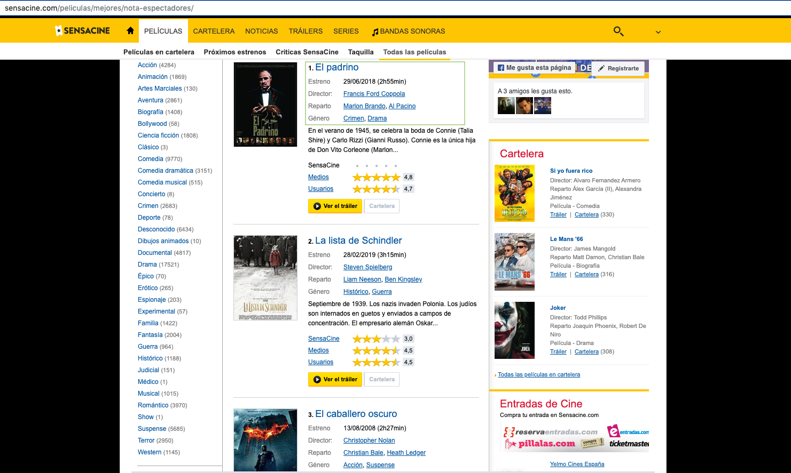

``` {css,echo=FALSE}

.header-panel {
    background-color: #bd62a0;
    min-height: 144px;
    position: relative;
    z-index: 3;
    background-image: url('hermoso1.jpeg');
    
}
.menu ul li.active {
    background-color: #e3b8d5;
    position: relative;
}

img {
  background-color: pink;
  padding: 5px;
  border: 1px solid pink;
  border-radius: 3px;
  margin: 0 5px;
  max-width: 100%;
}
```

```{r knitr_init, echo=FALSE, results="asis", cache=FALSE}
#======================================================================================
#LIBRERIAS USADAS
#======================================================================================
library(knitr)
library(rmdformats)
## Opciones de Presentacion
options(max.print = "75")
opts_chunk$set(echo = FALSE,
	             cache = FALSE,
               prompt = FALSE,
               tidy = FALSE,
               comment = NA,
               message = FALSE,
               warning = FALSE)
opts_knit$set(width = 75)
```

# Presentación


#### 


Trabajo Final R


Estudiante : María José Velandia Zambrano


Profesor : Carlos J. Gil Bellosta  


Master Big Data & Analytics  


EAE Business School  
2019

# Tabla de Contenido 

### Presentacion Final         


1. Objetivo   


2. Expresiones regulares  


3. Recursos de Markdown  


4. Tema Libre (El cine)


5. Gráficas


5. Referencias


# Objetivo


El objetivo de éste ejercicio es validar el conocimiento y  las habilidades adquiridas en el curso de R a través de la investigación al realizar la presentación del presente informe.


# Expresiones Regulares

Las expresiones regulares se tratan de patrones de secuencias de  caracteres que se emplean para comprobar si una cadena de texto se ajusta a un formato específico.

Por ejemplo, puede que una cadena deba contener dígitos numéricos, pero no espacios en blanco, o letras o signos de puntuación o que se quiera  comprobar que una cadena contiene una dirección de correo electrónico correctamente escrita.
En estos casos se crea un patrón que define el formato al que debe ajustarse una cadena y luego se compara con la misma. La forma de hacer estas comparaciones depende de cada lenguaje específico.


## ¿Y si comparamos? {.tabset}

En el primer tab se ilustra como se crea una expresion regular en el lenguaje de programación JavaScript en contraste con  el segundo tab en donde se evidencia cómo se crea una expresión regular en Python.

### Creación en Javascript

El uso de expresiones regulares en JavaScript es una buena manera de prevalidar el formato de ciertos datos en el lado del cliente, sin necesidad de recurrir a llamadas al servidor. Sin embargo, la forma de hacerlo es adecuada, también, en entorno de API’s de Node JS.

Esta es la forma más simple, antigua y rudimentaria de uso de expresiones regulares, pero también perfectamente válida para códigos simples. Supongamos que tenemos un campo de texto en la página, llamado CampoCorreo, destinado a que el usuario introduzca un correo electrónico. Lo que queremos es que, por ejemplo, al envío del formulario (evento onSubmit) se ejecute una función que valide la dirección de correo para comprobar si se ajusta a formato y, en caso de no hacerlo, no permita enviar el formulario. La función de nuestro ejemplo se va a llamar ValidarCorreo, y el código podría quedar así:

```
<!DOCTYPE html>
<html lang="en">
<head>
	<meta charset="UTF-8">
	<title>RegExp</title>
</head>
<body>
	<form action="recibir_formulario.php" onsubmit="javascript: return ValidarCorreo();">
		Correo Electrónico:
		<input type="text" id="CampoCorreo" name="CampoCorreo">
		<br>
		<input type="submit" value="Enviar">
	</form>
 
	<script language="javascript">
		var ExpresionCorreo = /^\w+([\.-]?\w+)*@\w+([\.-]?\w+)*(\.\w{2,4})+$/;
 
		function ValidarCorreo(){
			if (ExpresionCorreo.test(document.getElementById('CampoCorreo').value)){
				return true;
			} else {
				alert("El correo no es válido");
				return false;
			}
		}
	</script>
</body>
</html>
```


### Creación en Python

Ya vimos cómo validar un correo o email en JavaScript. Ahora hagamos lo mismo con Python, veamos una forma de saber si el usuario puso un correo válido.

Aunque el correo parezca válido, no lo sabremos hasta que lo comprobemos enviando un mensaje con un token o algo similar; pero bueno, el punto es ver si un correo es válido según su forma como cadena.

Al final, un usuario podría poner uno que sea temporal, o que sea falso, por lo que no importa mucho la validación, sino la comprobación de la existencia.

```
def es_correo_valido(correo):
    expresion_regular = r"(?:[a-z0-9!#$%&'*+/=?^_`{|}~-]+(?:\.[a-z0-9!#$%&'*+/=?^_`{|}~-]+)*|\"(?:[\x01-\x08\x0b\x0c\x0e-\x1f\x21\x23-\x5b\x5d-\x7f]|\\[\x01-\x09\x0b\x0c\x0e-\x7f])*\")@(?:(?:[a-z0-9](?:[a-z0-9-]*[a-z0-9])?\.)+[a-z0-9](?:[a-z0-9-]*[a-z0-9])?|\[(?:(?:(2(5[0-5]|[0-4][0-9])|1[0-9][0-9]|[1-9]?[0-9]))\.){3}(?:(2(5[0-5]|[0-4][0-9])|1[0-9][0-9]|[1-9]?[0-9])|[a-z0-9-]*[a-z0-9]:(?:[\x01-\x08\x0b\x0c\x0e-\x1f\x21-\x5a\x53-\x7f]|\\[\x01-\x09\x0b\x0c\x0e-\x7f])+)\])"
    return re.match(expresion_regular, correo) is not None

``` 


## Recursos de Markdown {.tabset .tabset-fade .tabset-pills}

Markdown es un lenguaje de marcado que facilita la aplicación de formato a un texto empleando una serie de caracteres de una forma especial. En principio, fue pensado para elaborar textos cuyo destino iba a ser la web con más rapidez y sencillez que si estuviésemos empleando directamente HTML, y si bien ese suele ser el mejor uso que podemos darle, también podemos emplearlo para cualquier tipo de texto, independientemente de cual vaya a ser su destino.

Vamos a comparar dos fuentes distintas que nos proporcionen información acerca de la creación de documentos en markdown y sacar nuestras propias conclusiones.   


### Primera Fuente

Su utilización. En principio, hay que reconocer que quienes más lo apreciarán son aquellos que publican contenido en la web de manera regular. Sin embargo, cualquiera que use un teclado como herramienta principal de trabajo podrá sacarle partido. Veamos entonces algunas de las ventajas que tiene su uso. El peso que tenga cada una dependerá de vosotros y considerarlas os ayudará a decidir si debéis probarlo o no.


Una vez que te acostumbras y conoces mínimamente la sintaxis, completas el texto más rápido. Si lo que hacemos normalmente es seguir un proceso del tipo "escritura -> revisión -> formato", las partes de revisión y formato las podemos hacer al mismo tiempo sin abandonar el teclado.

Además, la sintaxis de Markdown está pensada para que resulte más fácil de leer. Es decir, que los elementos de formato no estorben la lectura, como sí ocurre en HTML. Veamos un ejemplo sencillo, primero escrito con Markdown y luego con HTML

El HTML básico, que es el que necesitamos para dar formato a un texto, es sumamente sencillo de usar. Pero también es muy fácil cometer errores. El más habitual: olvidarse de cerrar una etiqueta de manera adecuada. Markdown hace que un error tan común como éste no se produzca.

A mucha gente le gusta escribir en texto plano, utilizando editores de texto o procesadores minimalistas por una cuestión de concentración: muchas veces, no necesitamos tantas herramientas como las que nos ofrece un procesador como Word, especialmente cuando todo lo que vamos a hacer es escribir un texto con un formato básico. De hecho, en ocasiones tal cantidad de herramientas sólo consiguen distraernos e incluso molestar.

Muchos de estos editores guardan los archivos en formato de texto plano. Usar Markdown nos permite que no tengamos que dejar de utilizar nuestra herramienta favorita para darle formato a un texto cuando sea necesario.

Si bien existen aplicaciones para dispositivos móviles que nos permiten aplicar formato a un texto, resulta bastante incómodo hacerlo por la misma naturaleza del sistema táctil. Si usamos una aplicación que soporta Markdown, tan sólo se trata de escribir unos pocos caracteres más. Es más rápido y ágil, especialmente si vamos aplicando el formato a medida que escribimos.


Para complementar está información ingresa a:
[https://www.genbeta.com/guia-de-inicio/que-es-markdown-para-que-sirve-y-como-usarlo](https://www.genbeta.com/guia-de-inicio/que-es-markdown-para-que-sirve-y-como-usarlo)

### Segunda Fuente

En este artículo vamos a hablar de los ficheros .md (MarkDown). En concreto, para esto nos interesa un fichero específico, con nombre README.md, que GitHub emplea para poner como página principal, o portada, de cada repositorio (de cada proyecto alojado, en la práctica).

Para complementar está información ingresa a:
[https://eldesvandejose.com/tag/archivos-md/](https://eldesvandejose.com/tag/archivos-md/)     


## Comentarios    

___


**Acerca de expresiones regulares:**

1. Por temas de implementacion y como se ilustra en el comparativo de la creación de expresiones regulares es más sencillo en un lenguaje de alto nivel como Python, pero eso siempre depende en que lenguaje de programación se este implementado la solución que se le ofrece al usuario final, por tanto al final del día y como es casi costumbre en los lenguajes de programación hay que enfocarse en la sintaxis puesto que la lógica es la misma.

**Markdown:**

1. En cuanto al contenido expuesto por las dos fuentes distintas acerca de markdown claramente la fuente uno ilustra con mayor propiedad la información con ejemplos e imágenes a las cuales puedes acceder ingresando a su página, la segunda fuente se queda pobre exponiendo el contenido del mismo.


# El cine
___

Los pasos que ha dado el cine a lo largo de más de un siglo de existencia confirman un trayecto histórico plagado de realidades que, en forma de películas, han consolidado una estructura creativa e industrial que ha permitido superar los problemas que han surgido al cabo de los años. En su evolución el cine ha consolidado un lenguaje, ha definido trayectos artísticos, modelos empresariales que han favorecido el surgimiento de carreras artísticas de todo tipo, construidas sobre modelos y representaciones que, en muchos casos, han trascendido su propio ámbito cinematográfico. En el camino, el cine se vio marcado por todo tipo de vanguardias artísticas, movimientos culturales, circunstancias políticas y conflictos bélicos.

Comparto una imágen que se quedó conmigo luego de ver una de mis peliculas favoritas comer,rezar,amar espero sea de su gusto y le recuerde la importancia de estar aquí en el ahora viviendo en el planeta tierra, en su momento fue una de las películas que me llevaron al camino de la meditación y el mundo espiritual.

___

<center> 

</center> 


## A quién no le gusta el cine?

Desde luego la magia del cine es tan maravillosa que todos nos hemos dejado envolver por una pelicula que a través de su forma de contar historias, sus paisajes , música o la sensacion que nos deja en el corazón se vuelven films para repetir en familia o con amigos y pareja.

El género sirve para etiquetar los contenidos de un filme, caracterizando los temas y componentes narrativos que relacionan dicha película con otras encuadrables en un mismo conjunto. En suma, se trata de categorías temáticas, codificadas a lo largo de los años e inteligibles por parte de los espectadores. Esta forma tipificada de narrar hereda muchas de esas categorías de la literatura, y muy singularmente de la narrativa popular, que reitera ciertos elementos para simplificar la comprensión del relato. Dado que ese tipo de convención aún predomina en el ciclo productivo del cine contemporáneo, resulta útil explorar los orígenes y evolución de los géneros más característicos el terror, la comedia, la ciencia-ficción, etc.aún hoy reconocibles por la audiencia que acude a las salas de exhibición.

Un espectáculo de masas como es el cine, necesita de una infraestructura industrial sólida que le permita evolucionar en el tiempo y ofrecer un conjunto de productos con los que los espectadores se sientan interesados para que dicha industria pueda seguir viva. Las transformaciones que se han apreciado en su dinámica interna fueron propiciadas por sus clientes habituales, por el progreso tecnológico y por el nacimiento de otros medios que marcaron los flujos de consumo en la sociedad de cada época. Lo que comenzó siendo un espectáculo de barraca de feria se ha convertido con el paso de los años en una industria poderosa y en uno de los negocios más importantes de los países más industrializados.    


Dicho esto he seleccionado la Web sensacine.com en donde sus usarios han votado por las mejores peliculas que el cine ha producido, lo he seleccionado para poder extraer los campos que se visualizan en el recuadro verde de la imágen expuesta abajo y que corresponden a : estreno, director, reparto y género. 


Para que te des una idea de lainformacion ingresa a la página fuente:
[http://www.sensacine.com/peliculas/mejores/nota-espectadores/](link)


  

<center> 
    
</center> 
  


Como resultado he cargado la siguiente tabla con las mejores películas según los usuarios de la página web:


```{r,layout="l-body-outset"} 
library(rvest)
library(rmdformats)
library(data.table)
library(lubridate)
library(rgeolocate)
library(tables)
library(dplyr)
library(formattable)
library(tidyr)
library(rmarkdown)
#======================================================================================
# Webscraping de la URL http://www.sensacine.com/peliculas/mejores/nota-espectadores/
#======================================================================================
ids <- 1:15
urls <- sapply(ids, function(i){
  url <- paste("http://www.sensacine.com/peliculas/mejores/nota-espectadores/?page=",i,sep = "") # Trae las páginas de la webpage
})

divs_peli <- sapply(urls,function(url){  # Trae los divs
   pagina_html <- read_html(url)
   peliculas <- html_nodes(pagina_html,xpath = '//div[@class="data_box"]/div/div')
   
})

matriz_pelis <- sapply(divs_peli,function(pelicula){
  # Trae todos los elementos div que estan dentro de un elemento li
    atributo_lis <- html_nodes(pelicula,'li div')
    titulo <- html_node(pelicula,'h2 a')  # trae el unico elemento a que esta dentro de un elemento h2

    # Datos de mi nuevo Data Frame
    titulo <- html_text(titulo)
    anio <- html_text(atributo_lis[1])
    director <- html_text(atributo_lis[2])
    reparto <- html_text(atributo_lis[3])
    genero <- html_text(atributo_lis[4])
    
    # Limpiar todos los campos de la tabla
    titulo  <-  gsub("\n","",titulo)
    estreno <- gsub("\n","",anio)
    anio <- substr(estreno,1,10)
    #anio <- format(dmy(anio), "%Y-%m-%d")
    duracion <- substr(estreno,11,20)
    duracion <- gsub("\\(|\\)","",duracion)
    director <- gsub("\n","",director)
    reparto <-  gsub("\n","",reparto)
    genero <-  gsub("\n","",genero)
    # Retornar todas las peluculas
    matriz <- matrix(c(titulo,anio,duracion,director,reparto,genero))
   
})
# Crear la tabla de todas las peliculas y renombrar sus campos
tabla_peliculas <- as.data.frame(t(matriz_pelis))
setnames(tabla_peliculas, old=c("V1","V2","V3","V4","V5","V6"), new=c("titulo","año","duracion","director","reparto","genero"))

# Mostrar el contenido de la tabla páginado por el tamaño de la misma
DT::datatable(tabla_peliculas,
         extensions = c('FixedColumns',"FixedHeader"),
           options = list(scrollX = TRUE,
                          paging=TRUE,
                          fixedHeader=TRUE))

```

Este es el top 5 de los directores más famosos:

``` {r , echo=FALSE} 
#======================================================================================
# Visualización de Tablas
#======================================================================================
# set colors
customGreen0 = "#f5c1ed"
customGreen = "#c183eb"
customRed = "#e3b8d5"

# encontrar el top de los directores más famosos
directores <- table(tabla_peliculas$director)
famosos <- as.data.frame(tail(sort(directores),5))
setnames(famosos,old=c("Var1","Freq"), new=c("director","cantidad peliculas"))

#formatear la salida de la tabla con el director mas famosos
formattable(famosos, align =c("l","c"), list(
    `director` = formatter("span", style = ~ style(color = "black",font.weight = "bold")),
    `cantidad peliculas`= color_tile(customGreen, customGreen0)
))
```
Las Películas del director más famoso y su correspondiente puesto en el ranking:

``` {r,echo=FALSE} 
#Visualualizar las peliculas del director más famoso
quienes <- table(tabla_peliculas$director)
famosos <- as.data.frame(tail(sort(quienes),5))
mas_famoso <- tail(famosos,1)
peliculas_famoso <- tabla_peliculas[tabla_peliculas$director == toString(mas_famoso$Var1),]
 
formattable(peliculas_famoso, align =c("l","l","l","l","l","l"), list(
   `titulo` = formatter("span", style = ~ style(color = "black",font.weight = "bold")),
   `año`= color_tile(customGreen, customGreen0),
   `duracion`= color_tile(customGreen, customGreen0),
   `director`= color_tile(customGreen, customGreen0),
   `reparto`= color_tile(customGreen, customGreen0),
   `genero`= color_tile(customGreen, customRed)
 ))
```

```

# Gráficas

Cantidad de peliculas de los Directores más famosos por nacionalidad.

```{r , echo=FALSE}

nacionalidad <- c('Nueva Zelanda','Estados Unidos','Reino Unido','Estados Unidos','Estados Unidos')
famosos['nacionalidad'] <- nacionalidad
fam <- melt(famosos)

ggplot(fam, aes(x = nacionalidad, y = value)) + geom_boxplot() + facet_wrap(~ variable)

ggplot(fam, aes(x = nacionalidad, y = value)) + 
  geom_violin(fill = "lightpink") + 
  facet_wrap(~ variable)
  
ggplot(fam, aes(x = nacionalidad, y = value)) + 
  geom_point() + geom_smooth() + 
  facet_grid(~ variable)
  
```


# Referencias


1. https://www.datadreaming.org/post/r-markdown-theme-gallery/

2. https://github.com/juba/rmdformats/blob/master/R/material.R

3. https://rdrr.io/find/?repos=cran%2Cbioc%2Crforge%2Cgithub&fuzzy_slug=material

4. https://github.com/jgm/highlighting-kate/blob/master/xml/markdown.xml

5. https://cran.r-project.org/web/packages/rmdformats/vignettes/introduction.html

6. https://eldesvandejose.com/2017/08/18/expresiones-regulares-general/

7. https://eldesvandejose.com/2017/08/18/expresiones-regulares-en-javascript/

8. https://parzibyte.me/blog/2018/12/04/comprobar-correo-electronico-python/

9. https://www.genbeta.com/guia-de-inicio/que-es-markdown-para-que-sirve-y-como-usarlo

10. https://eldesvandejose.com/tag/archivos-md/

11. https://lamenteesmaravillosa.com/estudios-cientificos-sobre-la-meditacion/


12. http://www.sensacine.com/peliculas/mejores/nota-espectadores/

13. https://rstudio-pubs-static.s3.amazonaws.com/435161_fcef306590d54b1aa5f49c0abf5f612e.html

14. http://recursos.cnice.mec.es/media/cine/bloque5/index.html